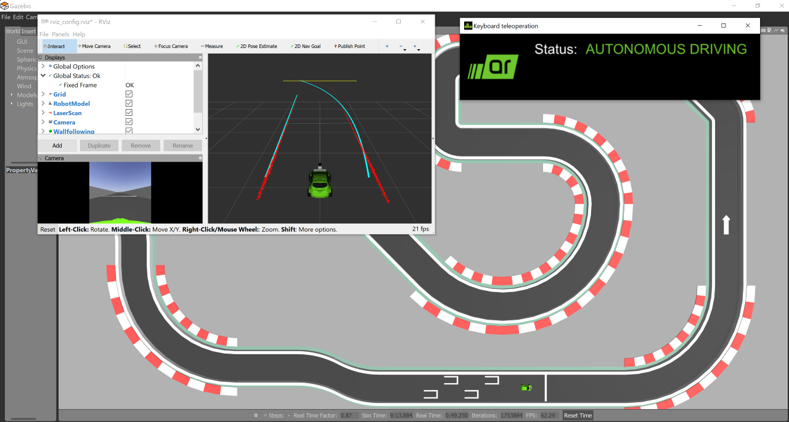
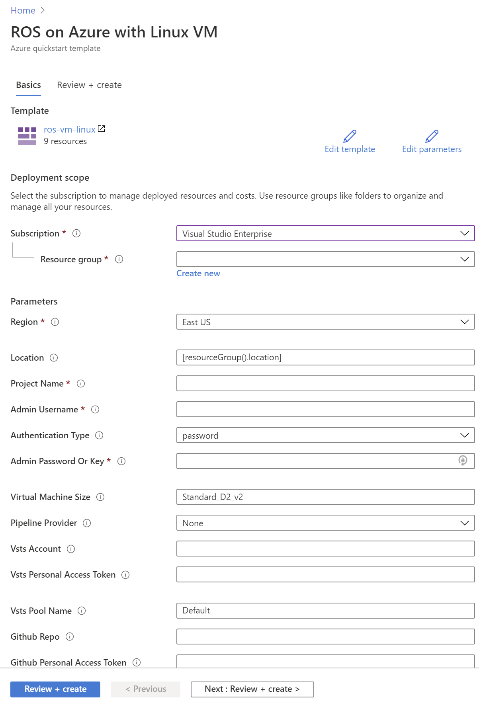
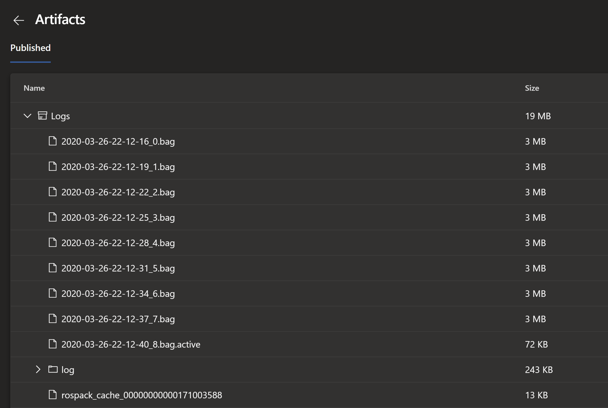

# ROS Simulation Lab on Azure Pipelines (Linux)

## Overview

After defining your robot behavior, it is important to ensure the robot running as expected as the project iterates.
This repository demonstrates how to run a autonomous car in the Gazebo simulator, test it on the rostest framework, and cloud-host the continuous integration on Azure Pipelines.

This lab uses the [software](https://github.com/Autonomous-Racing-PG/ar-tu-do) developed by the Autonomous Racing Project Group of [TU Dortmund](https://ls12-www.cs.tu-dortmund.de/daes/).
Credit goes to all the [contributors](https://github.com/Autonomous-Racing-PG/ar-tu-do/graphs/contributors).

## Objectives

* Run and observe the autonomous racecar simulation locally.

* Deploy and register a ROS on Linux virtual machine on Azure.

* Integrate a GitHub project with Azure Pipelines.

* Observe the simulation runs and test results on the pipeline.

## Prerequisites

* An Microsoft Azure account from https://portal.azure.com.

* An Azure DevOps account from https://dev.azure.com.

* A GitHub account from https://github.com.

This lab supports for both Windows and Linux.
For the Windows instructions, visit [here](./README.md).

## Exercise 1: Build And Run Autonomous Car Simulation Locally

1. Fork this repository into your GitHub account.
2. Follow this ROS Wiki [page](http://wiki.ros.org/Installation/Ubuntu) to install ROS Melodic on Ubuntu.
3. Open a new shell. The below example assumes using `bash`.

```bash
# Clone the github project
git clone https://github.com/<your account>/ros_simulation_lab --recursive
cd ros_simulation_lab

# install required components
sudo apt update
rosdep update
rosdep install --from-paths catkin_ws/src --ignore-src -r -y
pip install circle-fit

# build it
cd catkin_ws
catkin_make
```

4. Run the autonomous car simulation.

```bash
# source the ROS devel space.
source ./devel/setup.bat

# run the application
roslaunch src/ar-tu-do/ros_ws/launch/gazebo.launch world:=racetrack mode_override:=2
```

This launch file runs a racecar in a simulated track in Gazebo and runs autonomous driving.



## Exercise 2: Run ROSTest With Autonomous Car Simulation Locally

1. End the previous exercise and run the following rostest file:

```bash
# source the ROS devel space.
source ./devel/setup.bat

# run the rostest
rostest demo demo.test
```

This [`demo.test`](catkin_ws/src/demo/test/demo.test) runs the same task as the previous exercise but in headless mode.
Additonally, it runs a [`demo.py`](catkin_ws/src/demo/nodes/demo.py) node to kick off a validation on the latest lap time.
The [`demo`](catkin_ws/src/demo) package demonstrates an example how to organize your robot simulation with the rostest framework.
Now let's move this exercise to cloud-hosted environment with Azure Pipelines.

## Exercise 3: Provision Cloud CI Environment With Azure Pipelines

### Task 1: Prepare Permission For Azure DevOps Agent Pool

1. This [module](https://docs.microsoft.com/en-us/azure/devops/pipelines/agents/v2-windows?view=azure-devops#permissions) guides you how to prepare permission for the agent pool.
2. Take a note of the personal access token (PAT).

### Task 2: Deploy Virtual Machine and Register as Azure DevOps Build Agent

This [`ROS on Azure with Linux VM`](https://azure.microsoft.com/en-us/resources/templates/ros-vm-linux/) is a Azure quickstart template to help setup an Azure virtual machine with ROS installed.

1. Navigate to the template. Click `Deploy to Azure`.
2. A form will be brought to you and here are some important parameters for this exercise.
   * **Pipeline Provider**: Select `AzurePipelines` to use Azure DevOps.
   * **Vsts Account**: This is your Azure DevOps organization name. For example, this is the `name` of `https://dev.azure.com/<name>`.
   * **Vsts Personal Access Token**: This is the PAT noted from the previous section.
   * **Vsts Pool Name**: Leave it to `Default` to match the pool name in this exercise.

   


### Task 3: Integrate Your GitHub Projects With Azure Pipelines

1. Fork this repository into your GitHub account.
2. The [`Integrate Your GitHub Projects With Azure Pipelines`](https://www.azuredevopslabs.com/labs/azuredevops/github-integration/) guides you how to create a pipeline for a GitHub project in Task 1 & 2.
   Use your fork as the target repository.
3. Navigate to the "Existing Azure Pipelines YAML file" and select `azure-pipelines-linux.yml`.
4. Now you should have a pipeline running (or ready to run).

### Task 4: Observe the Build Summary and Test Results

1. Click on a finished build and you will see a summary like:
   

2. Check the `Related` and there is one artifact published, where you can find details logs for this run.
   In this example, you can also find the bag files for further analysis.
   

3. Check the `Test and coverage` and you can find details test results by following the pass rate hyperlink.
   
